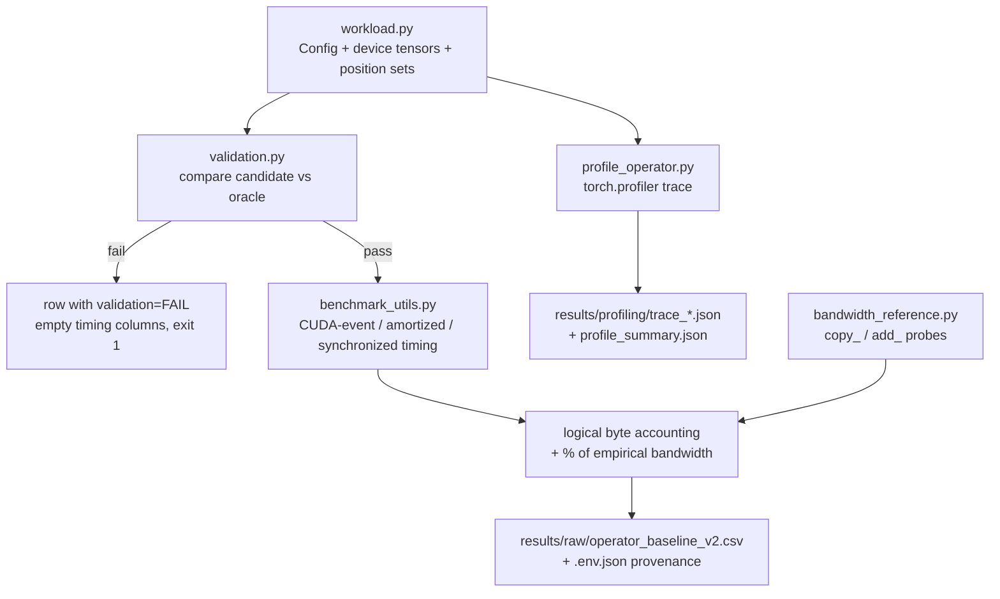

# decode_llm_kernel

A kernel-engineering project targeting **decode-time** LLM latency on the path between QKV
projection and attention. The unit under study is a **fused RoPE + KV-cache append** for one
autoregressive decode step: rotate `q` and `k` by rotary position embeddings, return the rotated
`q`, and scatter the rotated `k` and the raw `v` into their KV-cache slots. This repository
currently contains the **functional reference implementation** of that operation and a
**validated measurement rig** (correctness oracle, CUDA-event benchmark sweep, profiler capture,
empirical bandwidth reference) that establishes the baseline a custom CUDA kernel has to beat.
The custom CUDA kernel itself is **not yet written** — see [Development Status](#development-status).

---

## Overview

**Problem.** During autoregressive decode, the RoPE + KV-append step is tiny per token but runs
once per layer per token. In PyTorch it is a sequence of small elementwise ops and two scatter
writes. Profiling in this repo shows eager PyTorch issues **18 CUDA kernels per invocation**, and
that even after `torch.compile` fuses it down to 1–2 kernels, **~93% of the measured per-call cost
is host-side dispatch**, not GPU work.

**Purpose.** Build a custom fused CUDA kernel for this operation and prove — with a validation
gate and a reproducible measurement methodology — whether and where it wins. Scope is
evidence-driven: profiling decides what to optimize next.

**Intended users.** Kernel/systems engineers and anyone reproducing or extending the measurements.
This is a research/benchmarking repo, not a library to depend on.

**Primary inputs.** Synthetic decode-step tensors generated on device from a seed
(`q`, `k`, `v`, `positions`, RoPE `cos`/`sin` tables, `k_cache`, `v_cache`, `request_indices`).
No datasets, no model weights, no network access are required for anything currently in the repo.

**Primary outputs.** CSV/JSON result files with per-configuration latency, logical byte traffic and
validation status, plus profiler traces and kernel-count summaries, under [`results/`](results/).

**Maturity.** Checkpoints A (functional reference + correctness suite) and B/B.1 (measurement rig +
baseline sweep) are complete and committed. Checkpoint C (first custom CUDA kernels) has not
started. Everything measured here comes from one machine and one GPU.

---

## How It Works



Execution order for the main sweep ([`benchmarks/benchmark_operator.py`](benchmarks/benchmark_operator.py)):

1. **Bandwidth reference** — [`bandwidth_reference.py`](benchmarks/bandwidth_reference.py) measures
   achievable device bandwidth once, up front (skippable with `--skip-bandwidth-ref`), and its
   result becomes the denominator of `pct_of_empirical_bw`.
2. **Environment capture** — `env_metadata()` in
   [`benchmark_utils.py`](benchmarks/benchmark_utils.py) records GPU, driver, torch/triton/nvcc
   versions, git SHA and dirty state, dynamo/inductor settings and the full CLI args.
3. **Matrix expansion** — `build_matrix()` in [`workload.py`](benchmarks/workload.py) yields one
   `Config` per (head layout × batch × cache size × dtype × position mode).
4. **Footprint guard** — configurations whose peak contiguous cache (2 sets × `k_cache` + `v_cache`)
   exceeds `--footprint-budget-gb` are recorded as `impl=skipped`, never silently dropped.
5. **Validation gate** — [`validation.py`](benchmarks/validation.py) runs each implementation against
   the reference oracle on sentinel-filled caches, under both ragged and uniform addressing. **No
   timing is recorded for an implementation that has not passed.**
6. **Timing** — three distinct latency measures per passing implementation (see
   [Validation and Evaluation](#validation-and-evaluation)).
7. **Write-out** — a CSV of all rows plus a sibling `.env.json` with the environment and a run
   summary; nonzero exit if any configuration failed validation.

Profiling ([`profile_operator.py`](benchmarks/profile_operator.py)) is a separate entry point that
runs the same validated workload under `torch.profiler`, exports a Chrome trace per (impl, config),
and counts device events by category directly from that trace.

---

## Repository Structure

```text
decode_llm_kernel/
├── decode_kernels/
│   └── reference/
│       └── rope_cache.py          # functional reference: RoPE tables, rotate_half, apply_rope,
│                                  # fused_rope_kv_append_ref (the correctness oracle)
├── benchmarks/
│   ├── workload.py                # Config, tensor allocation, impl construction, sweep matrix
│   ├── positions.py               # deterministic uniform / ragged decode positions
│   ├── validation.py              # oracle comparison gate (runs before any timing)
│   ├── benchmark_utils.py         # timing primitives, stats, logical bytes, env capture, CSV/JSON
│   ├── benchmark_operator.py      # main sweep entry point: validate -> time -> write results
│   ├── bandwidth_reference.py     # empirical device memory-bandwidth reference
│   ├── profile_operator.py        # torch.profiler traces + kernel-count summaries
│   └── nsight_capture.sh          # Nsight Systems capture wrapper
├── tests/
│   ├── test_reference.py          # oracle correctness (incl. parity with HF Llama RoPE)
│   ├── test_positions.py          # position-generation invariants
│   ├── test_benchmark_bytes.py    # logical byte formula
│   └── test_benchmark_validation.py  # the gate itself, incl. 5 deliberately broken impls (CUDA)
├── results/
│   ├── LIMITATIONS.md             # what each result file does NOT establish — read before quoting
│   ├── raw/                       # baseline CSVs, env JSON, bandwidth reference
│   └── profiling/                 # traces, profile_summary.json, nsys kernel summaries
├── conftest.py                    # empty; present so pytest puts the repo root on sys.path
└── .gitignore
```

Not present yet, referenced by the plan: `csrc/` (the CUDA extension source for Checkpoint C).

**Local-only files.** `CLAUDE.md` and `docs/` are listed in [`.gitignore`](.gitignore) and are
**not** in the repository. On the working machine they hold the locked operation semantics
(`docs/operation_semantics.md`), the measurement methodology
(`docs/benchmark_methodology.md`) and workflow conventions (`docs/conventions.md`). This README
duplicates the parts a new developer needs; the tracked, always-available companion document is
[`results/LIMITATIONS.md`](results/LIMITATIONS.md).

---

## Architecture

### The operation (locked definition)

```python
q_rot = fused_rope_kv_append_ref(
    q, k, v,               # projected, pre-RoPE
    positions,             # per-token absolute position
    cos, sin,              # precomputed rotation tables, FP32
    k_cache, v_cache,      # mutated in place
    request_indices,       # which cache row each token belongs to
)
```

| Aspect | Decision |
| --- | --- |
| Layouts | `q:[T,Hq,D]`, `k`/`v:[T,Hkv,D]`, `positions:[T]`, `cos`/`sin:[max_position,D]`, caches `[B,max_seq,Hkv,D]` |
| RoPE convention | NeoX / split-half (`rotate_half`), **full** rotary — the HF Llama convention |
| Trig precision | tables built and stored **FP32**; rotation arithmetic done in FP32 for every input dtype, result cast back |
| Cache addressing | contiguous token-major: `cache[request_indices[i], positions[i]]` |
| Mutation | `k` slot gets the **rotated** key, `v` slot gets the **unmodified** value; no other slot changes |
| Return value | `q_rot` only; the caches are side effects |
| Dtypes | FP32 (reference), BF16 (primary), FP16 (secondary) |

`positions[i]` is simultaneously the RoPE table row and the destination cache slot for request `i`.

### Baseline ladder

Identical semantics, layout, dtype and synchronization throughout:

1. Functional reference (PyTorch, correctness oracle) — **implemented**
2. PyTorch eager — **implemented and measured** (`impl=eager`)
3. `torch.compile` — **implemented and measured** (`impl=compile`)
4. Separate custom CUDA kernels (RoPE kernel + append kernel, to isolate the fusion benefit) — **planned**
5. Fused custom CUDA kernel — **planned**
6. External optimized baseline (vLLM / FlashInfer / Triton) — **deferred**, choice to be driven by profiling

### Component interaction

- [`workload.py`](benchmarks/workload.py) is the single source of tensor construction. Validation,
  timing and profiling all allocate through `build_op_args()`, so an implementation can never be
  timed on different inputs than it was validated on.
- `make_thunk()` closes over pre-built device tensors and an `itertools.cycle` of pre-generated
  position sets, so the timed region contains no host-side generation, H2D copy, or sync.
- `compile_impl()` calls `torch._dynamo.reset()` and passes `dynamic=False` **per configuration**.
  This is deliberate: without it, dynamo caches on the code object, hits `recompile_limit` mid-sweep
  and silently falls back to eager, which previously contaminated the "compile" rows.
- **Error handling.** A `torch.compile` construction failure is caught and recorded as
  `validation=ERROR`; a validation mismatch is recorded as `validation=FAIL` with detail and empty
  timing columns; an oversized configuration is recorded as `impl=skipped`. All three cases stay in
  the CSV. Validation failures and errors make the process exit `1`.
  `profile_operator.py` instead **refuses to profile** an unvalidated configuration (`SystemExit`).

### External dependencies

`torch` (CUDA build) is required everywhere. `transformers` is required by exactly one test
(`test_rope_matches_hf_llama`, which imports it inside the test body). `triton` arrives with
torch and backs the inductor path. `nsys` (Nsight Systems) is optional — `nsight_capture.sh`
exits 127 with a message if it is not on `PATH`. No database, service or network access is used.

---

## Installation

### Hardware and system requirements

- **NVIDIA GPU required.** `benchmark_operator.py`, `bandwidth_reference.py` and
  `profile_operator.py` all exit immediately with "CUDA device required" if `torch.cuda.is_available()`
  is false. Most tests run CPU-only; `tests/test_benchmark_validation.py` is skipped without CUDA.
- **VRAM.** The default full sweep needs headroom for two concurrent cache sets; the default budget
  is 12 GB (`--footprint-budget-gb`). On less VRAM, lower the budget — configurations over it are
  skipped and logged rather than OOM-ing.
- A CUDA toolkit (`nvcc`) is **not** needed for anything currently in the repo. It will be needed
  for Checkpoint C's extension build.

### Verified environment

Recorded in [`results/raw/operator_baseline_v2.env.json`](results/raw/operator_baseline_v2.env.json)
and [`results/profiling/profile_summary.json`](results/profiling/profile_summary.json):

| Component | Version |
| --- | --- |
| GPU | NVIDIA RTX PRO 4000 Blackwell, compute capability 12.0 (`sm_120`), 23.42 GiB |
| Driver | 575.64.03 |
| PyTorch | 2.11.0+cu128 (CUDA runtime 12.8) |
| Triton | 3.6.0 |
| Python | 3.12.13 |
| `nvcc` | 12.9.86 (system toolkit; unused so far) |
| OS | Linux 6.8.0 (glibc 2.35) |
| transformers | 5.12.1 (test-only) |

> **No dependency manifest is checked in** — there is no `pyproject.toml`, `requirements.txt`,
> `environment.yml`, `setup.py` or `Dockerfile` in this repository. The commands below reconstruct
> the verified environment; they are not derived from a checked-in lockfile. Adding a manifest is
> an open gap.

### Setup

```bash
git clone https://github.com/sathviknookala/decode_llm_kernel.git
cd decode_llm_kernel

# the project's environment is a conda env named `cu`
conda create -n cu python=3.12
conda activate cu

# PyTorch matching the verified CUDA build (pulls triton as a dependency)
pip install torch --index-url https://download.pytorch.org/whl/cu128

# test-only dependency, needed by tests/test_reference.py::test_rope_matches_hf_llama
pip install transformers pytest
```

There is no build or install step: the code is imported from the repository root. `conftest.py`
at the root is what puts the root on `sys.path` for pytest, and the two script entry points insert
the repository root into `sys.path` themselves. Run everything from the repository root.

Verify the environment:

```bash
python -c "import torch; print(torch.__version__, torch.cuda.is_available(), torch.cuda.get_device_name(0))"
python -m pytest tests/ -q
```

---

## Configuration

There are **no configuration files and no environment variables** read by this project. All
configuration is command-line arguments plus module-level constants.

### Module-level constants

| Constant | File | Value | Meaning |
| --- | --- | --- | --- |
| `HEAD_CONFIGS` | [`workload.py`](benchmarks/workload.py) | `("mha",32,32,128)`, `("gqa",32,8,128)` | head layouts swept; MHA row is the Llama-2-7B anchor, GQA is a synthetic 4:1 variant |
| `DTYPES` | `workload.py` | `fp32`, `fp16`, `bf16` | dtype labels used in configs and result rows |
| `CACHE_SENTINEL` | `workload.py` | `7.5` | fill value for validation caches, so any stray write is detectable |
| `NUM_POSITION_SETS` | `workload.py` | `8` | pre-generated position sets cycled across timed invocations |
| `TOLERANCES` | [`validation.py`](benchmarks/validation.py) | fp32 `1e-6`, fp16 `1e-3`, bf16 `8e-3` | atol = rtol per dtype |
| `DEFAULT_FOOTPRINT_BUDGET_GB` | [`benchmark_operator.py`](benchmarks/benchmark_operator.py) | `12.0` | peak contiguous cache budget |
| `PEAK_CACHE_SETS` | `benchmark_operator.py` | `2` | validation briefly holds oracle + candidate caches simultaneously |
| `REPRESENTATIVE` | [`profile_operator.py`](benchmarks/profile_operator.py) | 4 configs (mha/gqa × b∈{1,32}, bf16, alloc 2048, ragged) | what gets profiled |
| `DEFAULT_BUFFER_MIB` | [`bandwidth_reference.py`](benchmarks/bandwidth_reference.py) | `512` | ~10× the 48 MiB L2, so the probe is DRAM-bound |

`build_matrix()` also accepts `head_labels`, `batches`, `allocs` and `dtypes` overrides, but the
CLI does **not** expose them — narrowing the sweep beyond `--quick` means editing the call site.

### Paths

Output paths default to repository-relative locations resolved from `REPO_ROOT` (computed from
`benchmark_utils.__file__`), so commands behave the same from any working directory:
`results/raw/operator_baseline_v2.csv`, `results/raw/bandwidth_reference.json`,
`results/profiling/`. Override with `--out` / `--outdir`.

### Secrets

None. Nothing in this repository reads credentials or contacts a network service. The one
credential-adjacent item is future work: the Llama-2 weights needed for the planned decoder
integration are gated on Hugging Face and would require an HF login on the developer's machine.

---

## Usage

All commands assume `conda activate cu` and the repository root as the working directory.

### 1. Run the tests

```bash
python -m pytest tests/ -q
```

75 tests. CPU-only except `tests/test_benchmark_validation.py`, which is skipped without CUDA.

### 2. Measure the empirical bandwidth reference

```bash
python benchmarks/bandwidth_reference.py
```

Runs two probes on 512 MiB buffers — `copy_` (device-to-device, counted as `2 × buffer_bytes`) and
`add_` (`y += a*x`, counted as `3 × buffer_bytes`) — and writes
`results/raw/bandwidth_reference.json`. Useful arguments: `--buffer-mib`, `--warmup`, `--iters`,
`--out`. The `copy_` median becomes the `reference_gbps` used elsewhere.

### 3. Smoke-run the operator sweep

```bash
python benchmarks/benchmark_operator.py --quick
```

Reduced matrix: both head layouts × batch {1, 32} × alloc {2048} × bf16 × both position modes =
8 configurations. Note that `--quick` **still writes to the default `--out` path**, overwriting
`results/raw/operator_baseline_v2.csv`; pass `--out` to send it elsewhere
(`results/raw/*_quick.csv` is gitignored for this purpose).

### 4. Run the canonical baseline sweep

```bash
python benchmarks/benchmark_operator.py --warmup 25 --iters 100
```

Full matrix: 2 head layouts × batch {1, 8, 32, 128} × alloc {128, 2048} × {bf16, fp16, fp32} ×
{uniform, ragged} = 96 configurations × 2 implementations. This is the command that produced the
committed results (190 rows: 188 timed, 2 skipped, 0 validation failures).

**Writes:** `results/raw/operator_baseline_v2.csv` and `results/raw/operator_baseline_v2.env.json`.
**Exit code:** `1` if any configuration failed validation or a compile construction errored.

Arguments:

| Argument | Default | Effect |
| --- | --- | --- |
| `--quick` | off | reduced smoke matrix |
| `--warmup` / `--iters` | 25 / 100 | warmup and timed iterations (`synchronized_call_ms` uses `max(10, iters//5)` samples) |
| `--seed` | 1234 | seeds tensor generation and ragged positions; recorded per row |
| `--position-mode` | `both` | `uniform`, `ragged`, or `both` |
| `--compile-backend` / `--compile-mode` | `inductor` / `None` | passed to `torch.compile` |
| `--device-index` | 0 | CUDA device |
| `--footprint-budget-gb` | 12.0 | skip configurations whose peak cache exceeds this |
| `--bandwidth-buffer-mib` | 512 | buffer size for the inline bandwidth reference |
| `--skip-bandwidth-ref` | off | skip it; `pct_of_empirical_bw` is then left empty |
| `--out` | `results/raw/operator_baseline_v2.csv` | CSV path; the env JSON is written alongside it |

### 5. Capture profiler evidence

```bash
python benchmarks/profile_operator.py --iters 20 --warmup 25
```

Profiles the four `REPRESENTATIVE` configurations under eager and compile, writing
`results/profiling/trace_<impl>_<config>.json` (openable in `chrome://tracing` or perfetto.dev)
and `results/profiling/profile_summary.json` (kernels per invocation, distinct kernels, device
time per invocation, top ops by self device time). Arguments include `--impls eager compile`,
`--single mha|gqa`, `--single-batch`, `--outdir`, and `--no-trace` (run the workload with NVTX
ranges but without the PyTorch profiler, for wrapping under an external profiler).

### 6. Capture Nsight Systems traces

```bash
./benchmarks/nsight_capture.sh "$(which python)"
```

Loops over {mha, gqa} × {eager, compile} at b=32, invoking `profile_operator.py --no-trace` under
`nsys profile`, then emits a `cuda_gpu_kern_sum` CSV per run into `results/profiling/`. Exits 127
if `nsys` is not installed. The `.nsys-rep` / `.sqlite` binaries are gitignored; only the summary
CSVs are tracked.

---

## Inputs and Outputs

| Item | Type | Description | Produced/provided by | Location |
| --- | --- | --- | --- | --- |
| Decode-step tensors | generated, in-memory | `q`, `k`, `v`, `positions`, `cos`/`sin`, `k_cache`, `v_cache`, `request_indices`, all seeded and device-resident | `build_op_args()` in `workload.py` | never written to disk |
| Position sets | generated, in-memory | 8 deterministic ragged (or uniform) position tensors per config | `positions.py` | never written to disk |
| Reference implementation | **source** | the correctness oracle | committed | [`decode_kernels/reference/rope_cache.py`](decode_kernels/reference/rope_cache.py) |
| Baseline results | **generated** | 190 rows × 23 columns of validation + latency + byte metrics | `benchmark_operator.py` | [`results/raw/operator_baseline_v2.csv`](results/raw/operator_baseline_v2.csv) |
| Run provenance | **generated** | environment, CLI args, dynamo/inductor settings, git SHA, run summary | `benchmark_operator.py` | [`results/raw/operator_baseline_v2.env.json`](results/raw/operator_baseline_v2.env.json) |
| Bandwidth reference | **generated** | `copy_` / `add_` medians and byte conventions | `bandwidth_reference.py` | [`results/raw/bandwidth_reference.json`](results/raw/bandwidth_reference.json) |
| Profiler summary | **generated** | kernels per invocation, distinct kernels, device µs per invocation, top ops | `profile_operator.py` | [`results/profiling/profile_summary.json`](results/profiling/profile_summary.json) |
| Chrome traces | **generated** | one per (impl, config) | `profile_operator.py` | `results/profiling/trace_*.json` |
| Nsight kernel summaries | **generated** | per-kernel time/instances | `nsight_capture.sh` | `results/profiling/nsys_*_cuda_gpu_kern_sum.csv` |
| Nsight binaries | **generated, untracked** | large and regenerable | `nsight_capture.sh` | `results/profiling/*.nsys-rep`, `*.sqlite` |
| Run logs | **generated, untracked** | stdout captures | shell redirection | `results/raw/*.log` |
| Archived v1 results | **generated, tracked** | superseded, **not comparable** to v2 | historical run | [`results/raw/archive/`](results/raw/archive/) |
| Limitations register | **source** | what each result file does not establish | committed | [`results/LIMITATIONS.md`](results/LIMITATIONS.md) |

Every file under `results/` is generated output that happens to be committed so claims can be
traced to data. Only `results/LIMITATIONS.md` and `results/raw/archive/README.md` are hand-written.

### Result CSV columns

`impl`, `head_label`, `num_q_heads`, `num_kv_heads`, `head_dim`, `num_requests`, `cache_alloc_len`,
`dtype_label`, `position_mode`, `seed`, `validation`, `validation_detail`, `device_median_ms`,
`device_p95_ms`, `device_min_ms`, `device_std_ms`, `amortized_call_ms`, `synchronized_call_ms`,
`logical_read_bytes`, `logical_write_bytes`, `logical_total_bytes`, `logical_eff_gbps`,
`pct_of_empirical_bw`.

`impl` ∈ {`eager`, `compile`, `skipped`}. `validation` ∈ {`pass`, `FAIL`, `ERROR`, `not-run`}.
Rows that are not `pass` have empty timing columns by construction.

**`cache_alloc_len` is an allocation size, not a scan length.** This operator never reads the
preceding context: per request it reads one RoPE table row and writes one K slot and one V slot.
Work is `O(num_tokens · heads · head_dim)` and independent of `cache_alloc_len`. The parameter only
controls cache allocation, the valid position range, and hence address locality. Flat latency
across it is the expected result and is **not** evidence of launch-bounding.

---

## Public Interface

The importable surface is [`decode_kernels.reference`](decode_kernels/reference/__init__.py):

```python
from decode_kernels.reference import (
    build_rope_tables, rotate_half, apply_rope, fused_rope_kv_append_ref,
)
```

| Function | Signature | Returns |
| --- | --- | --- |
| `build_rope_tables` | `(max_position, head_dim, theta=10000.0, *, device="cpu", dtype=torch.float32)` | `(cos, sin)`, each `[max_position, head_dim]`. Asserts `head_dim` is even. |
| `rotate_half` | `(x)` | `concat(-x2, x1)` over the last dim |
| `apply_rope` | `(x, cos, sin)` — `x:[T,H,D]`, `cos`/`sin:[T,D]` already gathered at each token's position | rotated `x`, same shape |
| `fused_rope_kv_append_ref` | `(q, k, v, positions, cos, sin, k_cache, v_cache, request_indices)` | `q_rot` with `q`'s dtype; **mutates `k_cache` and `v_cache` in place** |

Example:

```python
import torch
from decode_kernels.reference import build_rope_tables, fused_rope_kv_append_ref

T, Hq, Hkv, D, max_seq = 4, 32, 8, 128, 2048          # 4 decode requests, GQA 4:1
dev, dt = "cuda", torch.bfloat16

cos, sin = build_rope_tables(max_seq, D, device=dev)   # FP32 tables, by policy
q = torch.randn(T, Hq,  D, dtype=dt, device=dev)
k = torch.randn(T, Hkv, D, dtype=dt, device=dev)
v = torch.randn(T, Hkv, D, dtype=dt, device=dev)
k_cache = torch.zeros(T, max_seq, Hkv, D, dtype=dt, device=dev)
v_cache = torch.zeros_like(k_cache)

positions       = torch.tensor([17, 512, 1023, 2047], device=dev)
request_indices = torch.arange(T, device=dev)

q_rot = fused_rope_kv_append_ref(q, k, v, positions, cos, sin,
                                 k_cache, v_cache, request_indices)
```

**Error behavior.** The reference does no bounds checking — an out-of-range `position` raises from
PyTorch's own indexing. The out-of-bounds / duplicate-slot policy is explicitly still open and will
be settled when the append kernel is written.

**Stability.** No versioning or API stability guarantee. The oracle's signature is treated as
locked because the benchmark harness and every future kernel must match it positionally
(`candidate(*op_args)`), so any new implementation must accept the same nine positional arguments.

**Validating a new implementation** — the intended extension path:

```python
from benchmarks.validation import validate_or_raise
from benchmarks.workload import Config

cfg = Config("mha", 32, 32, 128, num_requests=8, cache_alloc_len=2048,
             dtype_label="bf16", position_mode="ragged")
report = validate_or_raise(my_impl, cfg, "cuda", seed=1234)   # raises ValidationError on mismatch
```

To add an implementation to the sweep, construct it in `workload.py` and append it to the `impls`
list in `run_config()` ([`benchmark_operator.py`](benchmarks/benchmark_operator.py)) with a new
`impl` label; validation and timing then apply to it unchanged.

---

## Testing

```bash
python -m pytest tests/ -q          # all 75 tests
python -m pytest tests/test_reference.py -q
python -m pytest tests/test_benchmark_validation.py -q    # requires CUDA
```

| File | Tests | Covers | Requires |
| --- | --- | --- | --- |
| [`test_reference.py`](tests/test_reference.py) | oracle correctness | parity with `transformers` `apply_rotary_pos_emb` to `1e-6`, `rotate_half` pairing, position 0 is identity, rotated Q returned, cache slots get rotated K and byte-exact raw V, unrelated entries unchanged, determinism, GQA shapes, single-request and boundary positions | CPU; `transformers` for the parity test |
| [`test_positions.py`](tests/test_positions.py) | position generation | uniform is the last valid slot, ragged in-bounds, seed determinism, distinct seeds differ, early/middle/late coverage, nonuniformity across requests, multiple slots across invocations, tiny allocations, unknown mode raises | CPU |
| [`test_benchmark_bytes.py`](tests/test_benchmark_bytes.py) | logical byte formula | hand-computed agreement, real `element_size()` (not assumed FP32), table dtype read from the tensor, mixed activation/cache dtypes, GQA < MHA, linearity in tokens, `logical_eff_gbps`, cache footprint | CPU |
| [`test_benchmark_validation.py`](tests/test_benchmark_validation.py) | **the gate itself** | oracle validates against itself; an independent correct implementation passes; five deliberately broken implementations are each caught (unrotated Q, unrotated K in cache, rotated V, off-by-one slot, clobbered unrelated slot); both position modes covered; GQA case; `validate_or_raise` raises and returns correctly | CUDA (skipped otherwise) |

There is no linter, formatter or type checker configured in the repository, and no CI workflow.

---

## Validation and Evaluation

Functional correctness and performance are deliberately separate, and correctness gates performance.

### Correctness gate

Per configuration, `validate_candidate()` runs the candidate and the oracle on identical inputs
across several position sets — two of the timed mode plus one uniform set, so **every configuration
is validated under both ragged and uniform addressing** — with caches pre-filled with the sentinel
`7.5` rather than zeros:

| Check | Criterion |
| --- | --- |
| rotated Q | `allclose` vs oracle at the dtype's tolerance |
| rotated K at addressed slots | `allclose` vs oracle **and** vs an independently recomputed `rope(k)` |
| raw V at addressed slots | `torch.equal` — byte-exact; V is never rotated |
| unaddressed cache slots | still exactly the sentinel |

Tolerances: FP32 `1e-6`, FP16 `1e-3`, BF16 `8e-3` (atol = rtol). Observed maxima are written into
each row's `validation_detail`.

### Latency measures

Three different things are measured; they are not interchangeable.

| Column | Definition |
| --- | --- |
| `device_median_ms` / `p95` / `min` / `std` | distribution of per-invocation **device-timeline** spans, from CUDA events recorded immediately before and after each individual call. Because the GPU idles while the host enqueues, this span also absorbs host dispatch latency. |
| `amortized_call_ms` | wall time of an **unsynchronized** loop of `iters` calls ÷ `iters`. Steady-state cost with launches pipelined — **not** a per-call latency. |
| `synchronized_call_ms` | median wall time of **individually** synchronized calls (sync, one call, sync). Full launch + drain, no pipelining. |

`amortized_call_ms < device_median_ms` is expected, not a contradiction.

### Logical byte accounting

`logical_bytes()` derives every term from the corresponding tensor's real `element_size()`, so a
mixed-precision run (FP32 trig tables feeding BF16 activations) is billed correctly.

- Reads: `q` + `k` + `v` (`T·H·D·element_size`) + `cos` + `sin` at `T·(D/2)·element_size` each —
  **`D/2`, not `D`**, because split-half RoPE builds each table row as `cat(f, f)`, so a row holds
  only `D/2` distinct values.
- Writes: `q_rot` + the addressed `k_cache` and `v_cache` slots.
- GQA needs no special case: Q terms use `Hq`, K/V and cache terms use `Hkv`.

`logical_eff_gbps = logical_total_bytes / device_median_ms`. **This is a logical floor, not
measured DRAM traffic.** It excludes intermediates an implementation materializes (eager's
`rotate_half` concatenation, gathered trig rows, cast temporaries), excludes whole-sector overhead
on scattered writes, and counts bytes that may be served from L2. `pct_of_empirical_bw` compares it
against a streaming `copy_` throughput on a very different access pattern. Treat both as
orientation, not as an efficiency score.

### Position modes

- **`uniform`** — every request decodes at `cache_alloc_len - 1`. A controlled comparison, but
  unrealistically favourable: every timed invocation rewrites the same L2-resident slot.
- **`ragged`** (the realistic default) — seeded positions stratified over the early/middle/late
  thirds of the allocated cache, mixing short and long requests the way continuous batching does.
  Eight sets are pre-generated and cycled across timed invocations.

### Interpreting the committed results

From [`results/raw/operator_baseline_v2.csv`](results/raw/operator_baseline_v2.csv) and
[`results/profiling/profile_summary.json`](results/profiling/profile_summary.json), on the single
machine described above:

**Launch structure — read off traces, never inferred from latency:**

| impl | kernels / invocation | distinct kernels | device time / invocation |
| --- | --- | --- | --- |
| eager | **18.0** | 8 | 29.7–33.4 µs |
| `torch.compile` | **1.0–2.0** | 1–3 | 1.6–2.7 µs |

Eager's 18 kernels are not the four "obvious" ops — they include two `CatArrayBatchedCopy` from the
`torch.cat` inside `rotate_half`, two trig-row gathers and two dtype casts. Inductor collapses all
of it into a single fused Triton kernel at MHA b=32.

**Dispatch dominates.** For compiled MHA b=32 the GPU work is ~1.6–1.8 µs inside a 25.5 µs measured
call — **~93% of the call is host-side dispatch and launch.** This is the profiler-backed version
of the "launch-bound" claim.

**Bandwidth headroom is regime-dependent.** Empirical reference is **553 GB/s** (`copy_` median;
`add_` cross-check 571 GB/s) — not the ~1 TB/s originally assumed. Best observed logical effective
bandwidth: compiled MHA b=128 FP32 reaches 484 GB/s = **88% of empirical** (near-saturated), while
compiled MHA b=1 BF16 reaches 1.1 GB/s = **0.2%** (almost pure overhead).

**Uniform positions flattered b=1.** The ragged/uniform device-median ratio has a sweep-wide median
of 1.003 and stays within 0.96–1.23 everywhere except compiled b=1, where it is **1.37–1.49** —
repeatedly rewriting one slot kept it L2-resident and understated realistic scattered-write cost by
up to ~45%, exactly in the regime that matters most for decode.

**Consequence for the kernel work.** `torch.compile` is the bar to beat, not eager: at b≥8 the
compiled path is **2.7–4.1× faster** than eager on device median (median 3.4×). The opportunity is
the small-batch regime; at b=128 FP32 there is little bandwidth headroom left.

**Before quoting any of these numbers, read [`results/LIMITATIONS.md`](results/LIMITATIONS.md).**

---

## Development Workflow

- **Branch.** `main` is the only branch; the remote is
  `github.com/sathviknookala/decode_llm_kernel`.
- **Commits.** History uses Conventional-Commit prefixes with a scope —
  `feat(bench):`, `fix(bench):`, `refactor(bench):`, `test(reference):`, `docs(results):`,
  `results(bench):`, `style(reference):`, `chore:`. Results commits are one-claim-per-commit and
  the subject states the claim or the assumption it overturns (e.g. *"empirical bandwidth is
  553 GB/s, not the ~1 TB/s we assumed"*).
- **Comment style.** No block comments or docstrings restating a signature. Comment only where
  intent is non-obvious — a tradeoff, a gotcha, a *why not what* — and keep it to one line.
- **Before committing.** Run `python -m pytest tests/ -q`. If you touched anything in `benchmarks/`,
  re-run at least `python benchmarks/benchmark_operator.py --quick --out <scratch path>` and confirm
  it exits 0.
- **Adding a measurement claim.** Regenerate the CSV, commit the CSV *and* its `.env.json` together
  (the JSON carries the git SHA and CLI args that produced it), and update
  [`results/LIMITATIONS.md`](results/LIMITATIONS.md) with what the new file does not establish.
  Do not overwrite a result file with a `--quick` run.
- No `CONTRIBUTING.md`, CI pipeline, PR template or release process exists.

---

## Reproducibility

- **Seeding.** A single `--seed` (default 1234) drives per-tensor `torch.Generator` construction and
  ragged position generation. The seed is written into every result row.
- **Determinism of positions.** Ragged sets are generated on CPU from a seeded generator and moved
  to the device, so they do not depend on device RNG behavior.
  `tests/test_positions.py::test_ragged_is_deterministic_for_a_seed` pins this.
- **Provenance capture.** Every result JSON embeds GPU name/VRAM/compute-capability/SM count,
  driver, torch/CUDA/cuDNN/triton/Python versions, `nvcc` version, OS and kernel release, the git
  SHA **and dirty-file list**, dynamo/inductor settings, and the full CLI args.
- **Compile determinism.** `torch._dynamo.reset()` + `dynamic=False` per configuration ensures each
  configuration is compiled fresh rather than reusing or falling back.
- **Hardware sensitivity.** All committed numbers come from one RTX PRO 4000 Blackwell (`sm_120`).
  No cross-architecture claim is supported. Clocks are not locked and there is no thermal soak, so
  differences of a few percent are noise.
- **Not pinned.** There is no lockfile; the environment table above is a record of what was used,
  not an enforced constraint. Results from a different torch/triton version will differ, especially
  for the inductor path.
- **Comparability.** `results/raw/archive/operator_baseline_v1_preB1.csv` is **not** comparable to
  v2 — see [`results/raw/archive/README.md`](results/raw/archive/README.md) for the five reasons.

---

## Performance

- **Scale.** Single decode step; `num_tokens` = active decode requests (1–128 in the sweep),
  `head_dim` 128, MHA 32/32 and GQA 32/8, caches up to 2048 slots.
- **Known bottleneck.** Host-side dispatch in the small-batch regime (~93–94% of the compiled call
  at b=1 and b=32). At b=128 FP32 the compiled path is near bandwidth saturation instead.
- **Resource requirements.** The 12 GB default cache budget; `mha b=128 alloc=2048 fp32` needs
  17.2 GB peak (2 sets × 8.6 GB) and is therefore skipped and logged — a preview of why paged
  caches exist.
- **Benchmark commands.** See [Usage](#usage) steps 2–4.
- **Profiling tools.** `torch.profiler` via `profile_operator.py`; Nsight Systems via
  `nsight_capture.sh`. Nsight **Compute** has not been run, so there are no occupancy, register-
  pressure, sector-efficiency or achieved-bandwidth counters — nothing here explains *why* a kernel
  takes the time it does.
- **Tradeoff not modelled.** This operation only *writes* the cache. A layout or kernel that speeds
  writes may slow the attention reads that follow, and that is invisible in these measurements.

All figures above are measured, not estimated, subject to the caveats in
[`results/LIMITATIONS.md`](results/LIMITATIONS.md).

---

## Development Status

### Implemented and verified

- Functional PyTorch reference `fused_rope_kv_append_ref`, matching HF Llama's
  `apply_rotary_pos_emb` to `1e-6`.
- 75-test suite covering the oracle, position generation, the byte formula, and the validation gate
  itself (including five deliberately broken implementations).
- Measurement rig: deterministic workload construction, ragged/uniform positions, a
  validate-then-time driver, three distinct latency measures, logical byte accounting, empirical
  bandwidth reference, environment/provenance capture.
- Baseline sweep over eager and `torch.compile`: 190 rows, 188 timed, 0 validation failures,
  2 logged footprint skips.
- Profiler evidence: PyTorch traces and kernel counts for 4 representative configurations; Nsight
  Systems kernel summaries for 4 runs.

### Not implemented

- **The custom CUDA kernel.** There is no `csrc/`, no `bindings.cpp`, no extension build. Ladder
  rungs 4 (separate RoPE + append kernels) and 5 (the fused kernel) are the next work
  (Checkpoint C), targeting the small-batch regime, each gated on the same validation and timed
  through the same harness under a new `impl` label.
- **CUDA-graph baseline.** Identified in `results/LIMITATIONS.md` as *"the highest-value gap"*:
  until a graph-captured variant exists, "dispatch-bound" is supported by the profiler arithmetic
  but the recoverable fraction is unquantified.
- **Nsight Compute counters.** No measured DRAM traffic; `logical_eff_gbps` must never be presented
  as physical traffic.
- **Decoder integration.** No model, no decode loop. The planned Llama-2-7B integration is blocked
  on Hugging Face gated-weight access.
- **External optimized baseline** (vLLM / FlashInfer / Triton) — deferred until profiling justifies
  the choice.

### Deliberately out of scope for now

Paged / fragmented / head-major cache layouts; partial rotary and non-128 head dims; FP8/FP4
(physically supported on `sm_120`); MQA benchmarking (covered in the byte-formula tests only);
`torch.compile` modes other than default inductor. Triton is explicitly **not** an implementation
path — it may appear only as an optional comparison baseline.

### Known limitations

- All results come from one GPU and one software stack.
- GQA rows are synthetic — the anchor model (Llama-2-7B) is pure MHA, so no GQA number here is
  corroborated by a real model.
- The timed region is an operator *call*, including PyTorch dispatch and one iterator step — not a
  bare kernel time. It is identical across implementations, so comparisons remain fair.
- No dependency manifest, no CI, no linting or type checking.
- `docs/` and `CLAUDE.md` are gitignored, so a clone has this README and
  `results/LIMITATIONS.md` but not the full reference docs.

---

## Troubleshooting

| Symptom | Cause | Resolution |
| --- | --- | --- |
| `SystemExit: CUDA device required for benchmarking` (or `CUDA device required`) | `torch.cuda.is_available()` is false — CPU-only torch, no driver, or no visible GPU | Install a CUDA build of torch and check `nvidia-smi`; verify with the one-liner in [Installation](#installation) |
| `ModuleNotFoundError: No module named 'benchmarks'` / `'decode_kernels'` | running from a different working directory, or importing the modules in a context without the repo root on `sys.path` | Run from the repository root. The two script entry points self-insert the root; `conftest.py` handles pytest. For ad-hoc scripts, set `PYTHONPATH=$PWD` |
| `ModuleNotFoundError: No module named 'transformers'` during tests | `test_rope_matches_hf_llama` imports it inside the test body and has no skip guard | `pip install transformers`, or deselect that test |
| `tests/test_benchmark_validation.py` reports 20+ skipped | no CUDA device — that module is `skipif`-guarded | Expected on CPU-only machines; the gate is untested there |
| Benchmark exits `1` with `VALIDATION FAILED` | an implementation's output diverged from the oracle | Read `validation_detail` in the CSV; the offending rows have empty timings on purpose. Fix the implementation — do not relax the tolerance to make it pass |
| `SKIPPED ... peak contiguous cache N GB > budget` | the configuration's two cache sets exceed `--footprint-budget-gb` | Expected for `mha b=128 alloc=2048 fp32` on a 24 GB card. Lower the sweep or raise the budget only if VRAM allows |
| CUDA OOM during the sweep | footprint budget set too high for the actual free VRAM | Lower `--footprint-budget-gb`; remember validation transiently holds two cache sets |
| Compiled rows are slower than eager | dynamo hit `recompile_limit` mid-sweep and silently fell back to eager | Already fixed via per-config `torch._dynamo.reset()` + `dynamic=False` in `compile_impl()`. If it recurs, check `dynamo.recompile_limit` in the run's `.env.json` |
| `results/raw/operator_baseline_v2.csv` overwritten by a smoke run | `--quick` still writes to the default `--out` | Pass `--out results/raw/operator_baseline_quick.csv` (gitignored) and restore the canonical file with `git checkout` |
| `nsys not found on PATH; skipping Nsight capture.` (exit 127) | Nsight Systems is not installed | Install Nsight Systems, or rely on `profile_operator.py`'s PyTorch traces |
| `nvcc` version-check warning when a CUDA extension is eventually built | system `nvcc` is 12.9 while torch is built for cu128 (12.8); both target `sm_120` | Anticipated for Checkpoint C; may need `TORCH_CUDA_ARCH_LIST=12.0` and/or an nvcc version override |

---

## Security

Nothing in this repository handles credentials, authenticates to a service, or accepts untrusted
input: all inputs are synthetic tensors generated locally from a seed, and no file in the repo
reads an environment variable or a secret. No secrets are committed.

Two forward-looking notes: the planned Llama-2-7B integration requires Hugging Face gated-model
access, which must come from a developer's own HF login and must never be committed; and the
planned CUDA extension will compile and load native code into the Python process, so it should be
built from this repository's own sources only.

There is no security-reporting policy file; report issues through the GitHub repository.

---

## Contributing

There is no `CONTRIBUTING.md`. Follow [Development Workflow](#development-workflow): match the
existing Conventional-Commit style and comment conventions, keep the validation gate strict, run
`python -m pytest tests/ -q` before committing, and commit any regenerated result file together with
its `.env.json` and a corresponding update to [`results/LIMITATIONS.md`](results/LIMITATIONS.md).

A new implementation of the operation must accept the same nine positional arguments as
`fused_rope_kv_append_ref`, pass `validate_candidate` under both position modes, and be timed
through the existing harness under a new `impl` label — no separate timing code.

## License

**This repository does not currently specify a license.** No `LICENSE` file is present, so default
copyright applies and no usage rights are granted.
